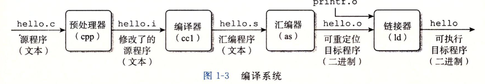

# 程序被其他程序翻译成不同的格式

hello程序的生命周期是从一个高级C语言程序开始的，因为这种形式能够被人读懂。然而，为了在系统上运行[hello.c](../src/hello.c)程序，每条C语句都必须被其他程序转化为一系列的低级`机器语言`指令。然后这些指令按照一种称为可执行目标程序的格式打好包,并以二进制磁盘文件的形式存放起来。目标程序也称为`可执行目标文件`。

在Unix系统上，从源文件到目标文件的转化是由编译器驱动程序完成的：
- unix> gcc -o hello hello.c

在这里，GCC编译器驱动程序读取源程序文件hello.c，并把它翻译成一个可执行目标文件hello。这个翻译的过程可分为四个阶段完成，如[图1-3](../pic/pic1-3.png)所示。执行这四个阶段的程序（`预处理器(cpp)`、`编译器(ccl)`、`汇编器(as)`和`链接器(ld)`）一起构成了`编译系统（compilation system）`。

- `预处理阶段`。**预处理器**根据字符`#`开头的命令，修改原始的C程序。比如hello.c中第一行的`#include <stdio.h>`命令告诉预处理器读取系统头文件`stdio.h`的内容，并把它**直接插入到程序文本中**。结果就得到了另一个C程序，通常是以`.i`作为文件扩展名。

- `编译阶段`。**编译器**将文本文件`hello.i`翻译成文本文件`hello.s`，它包含一个`汇编语言程序`。汇编语言程序中的每条语句都以一种标准的文本格式确切地描述了一条低级机器语言指令。汇编语言是非常有用的，因为它**为不同高级语言的不同编译器提供了通用的输出语言**。例如，C编译器和Fortran编译器产生的输出文件用的都是一样的汇编语言。

- `汇编阶段`。接下来，**汇编器**将`hello.s`翻译成机器语言指令，把这些指令打包成一种叫做`可重定位目标程序（relocatable object program）`的格式，并将结果保存在目标文件`hello.o`中。`hello.o`文件是一个**二进制文件**，它的字节编码是**机器语言指令而不是字符**。如果我们在文本编辑器中打开`hello.o`文件，看到的将是一堆乱码。

- `链接阶段`。请注意，`hello`程序调用了`printf`函数，它是每个C编译器都会提供的标准C库中的一个函数。`printf`函数存在于一个名为`printf.o`的单独的预编译好了的目标文件中，而这个文件必须以某种方式合并到我们的`hello.o`程序中。`链接器（ld）`就负责处理这种合并。结果就得到了`hello`文件，它是一个`可执行目标文件`（或者简称为`可执行文件`），可以被加载到内存中，由系统执行。

