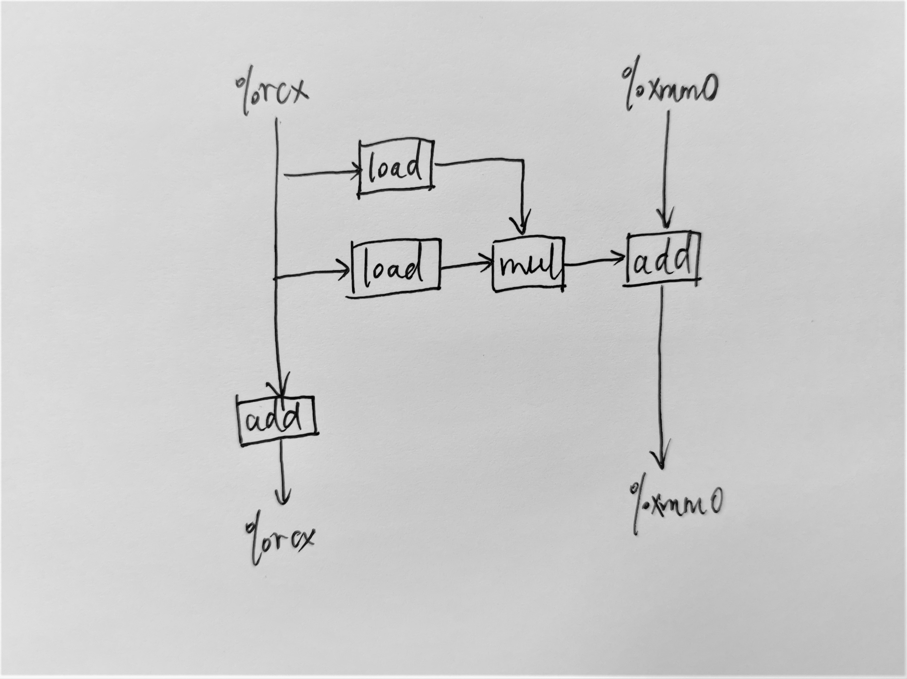

# Chapter 5
## Solutions to Homework Problems

### 5.13
[5.13.c](./src/5.13.c)

A.

B.

Just as displayed in above picture, the key path is `add` cell. 
According to Figure 5.12, the lower bound on the CPE is 3.0.

C.

Same as above analysis, the lower bound on the CPE is 1.0.

D.

As we can see from above pic, there is only one `add` cell on key path.
Therefore, the cycle of `mul` can not impact CPE.

### 5.14
[5.14.c](./src/5.14.c)

A.

Using 6x1 loop unrolling, we cannot change the limiting factors.
There are 6 float/long `add` cells on key path.
Therefore, the lower bound on CPE is still 1.0.

B.

Same as above answer.

### 5.15
[5.15.c](./src/5.15.c)

The following factors may limit the performance to a CPE 1.0:
1. the number of registers is limited; the performance cannot improve when reaching maximum utilization of registers.(Register Spilling)

### 5.16
[5.16.c](./src/5.16.c)

### 5.17
[5.17.c](./src/5.17.c)

### 5.18
Polynomial evaluation in [Practice Problem 5.5](./src/5.5.c) and [Hornor's Method 5.6](./src/5.6.c).

**5.5**
> The performance-limiting computation here is the repeated computation of the expression `xpwr *= x`. This required a floating-point multiplication (5 clock cycles), and the computation for one iteration cannot begin until the one for the previous iteration has completed. The updating of result only requires a floating-point addition(3 clock cycles) between successive iterations.

**5.6**
> The performance-limiting computation here is the repeated computation of the expression `result = a[i] + x * result`. Starting from the value of `result` from the previous iteration, we must first multiply it by x (5 clock cycles) and then add it to `a[i]` (3 clock cycles) before we have the value for this iteration. Thus, each iteration imposes a minimum latency of 8 cycles, exactly our measured CPE.

The solution to this problem can be found in [5.18](./src/5.18.c)

I also provide a [test](./src/poly.c) to verify the validity of this solution, and give a comparison between the results of different evaluation ways.

### 5.19
I provide a [psum](./src/psum.c) source code and a revised version in [5.12](./src/5.12.c).
